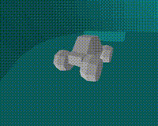
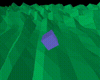
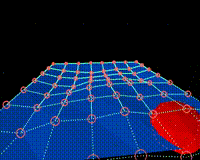
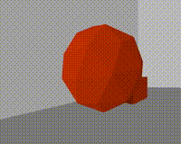
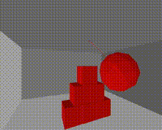
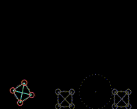

# Tiny_Physics_Engine
tinyphysicsengine in jai lang
rewritten from [text](https://github.com/ESPboy-edu/ESPboy_tinyphysicsengine)
# tinyphysicsengine

## how to

For a basic use see the `test_hello.jai` example program and `test_hello2.jai` as the next, then take a look at the more complex ones. Also see the library file itself, it is highly commented and is supposed to serve as its own documentation.

